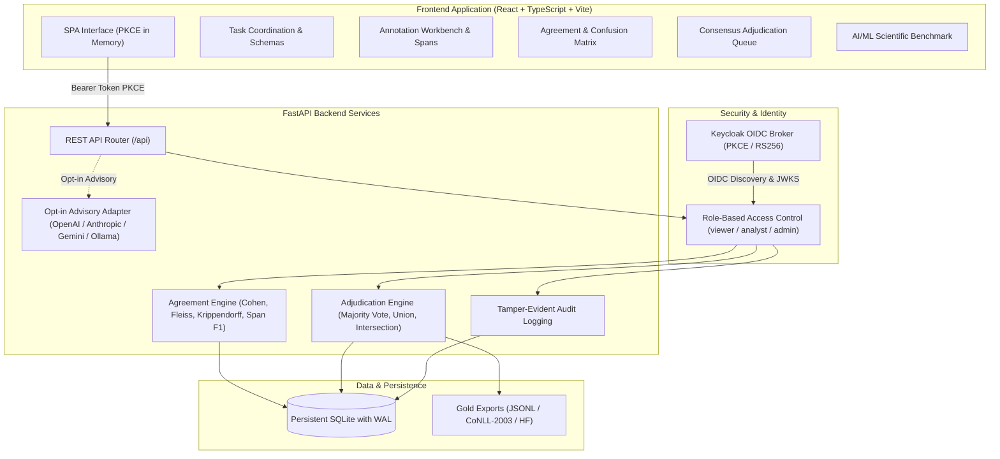

# Annotation Agreement Studio | Ryan Vo | AI & Machine Learning

Current version: `1.0.0`.

Annotation Agreement Studio solves the problem of unreliable, noisy human and model annotations in natural language processing (NLP) pipelines by providing a rigorous inter-annotator agreement evaluation engine, disagreement diagnostic matrices, and structured consensus adjudication. Built for NLP engineers, linguistic annotators, and machine learning researchers, the platform coordinates multi-annotator span tagging (NER, PII, BIO) and document classification tasks, computes statistical reliability metrics (Cohen's Kappa, Fleiss' Kappa, Krippendorff's Alpha, and token-level span IoU/F1), diagnoses boundary misalignments, and reconciles gold-standard datasets with an immutable audit trail.



---

## Core Features

- **Multi-Annotator Task Coordination**: Configure taxonomies, entity classes, BIO schemas, and annotation guidelines for span extraction and document classification.
- **Statistical Inter-Annotator Agreement Engine**:
  - **Cohen's Kappa**: Pairwise categorical and token-level inter-annotator agreement with Landis-Koch benchmarks.
  - **Fleiss' Kappa**: Multi-rater agreement for $N$ annotators across arbitrary categories.
  - **Krippendorff's Alpha**: Nominal coincidence matrix accounting for missing annotator coverage.
  - **Span-Level Metrics**: Exact Match IoU, relaxed overlap Precision/Recall/F1, and token BIO tag projection.
- **Diagnostic Disagreement & Confusion Matrices**: Interactive transition tables highlighting top confusing category pairs (e.g. `ORG` vs `MISC`, `NEGATIVE` vs `MIXED`).
- **Span Boundary Misalignment Detector**: Distinguishes semantic differences from mechanical boundary artifacts:
  - `whitespace_trim`: Leading/trailing whitespace inclusions.
  - `punctuation_boundary`: Trailing commas, periods, or quotation marks.
  - `prefix_extension`: Honorifics, titles, or articles (e.g., "Dr." or "The").
  - `suffix_extension`: Corporate designators (e.g., "Inc." or "LLC").
- **Consensus Adjudication & Gold Export**:
  - Rule-based auto-reconciliation: Majority voting, Span Union (maximum recall), Span Intersection (strict precision), or Expert Priority.
  - Interactive manual override with mandatory adjudication notes.
  - Export gold datasets in standard formats: JSONL, CoNLL-2003 IOB2, and Hugging Face datasets.
- **Opt-in Advisory LLM Explainer**: Grounded linguistic assistance explaining semantic ambiguities and recommending guideline clarifications. Pure `httpx` adapters supporting OpenAI-compatible, Anthropic, Gemini, and Ollama with error redaction and deterministic offline defaults.
- **Enterprise-Grade OIDC Authentication**: Keycloak authorization code flow with PKCE, RS256 token verification, viewer/analyst/admin RBAC, and local demonstration mode.

---

## AI/ML Evaluation

To demonstrate empirical validity, Annotation Agreement Studio includes a built-in evaluation benchmark suite (`AgreementBench-Reference-NLP-v1`) comprising 5 curated test documents spanning clinical records, financial disclosures, and sentiment reviews annotated by 3 independent annotators with known intentional edge cases.

### Reproducible Evaluation Command

```bash
PYTHONPATH=backend python3 -m app.services.benchmark_eval
```

### Measured Benchmark Results

| Metric | Measured Score | Evaluation Target |
| :--- | :--- | :--- |
| **Mean Pairwise Cohen's Kappa** | `0.4643` | Moderate baseline agreement across ambiguous edge cases |
| **Fleiss' Kappa (All Annotators)** | `0.4194` | Multi-rater agreement on polysemous categories |
| **Krippendorff's Alpha** | `0.4839` | Nominal agreement accounting for coincidence margins |
| **Average Span Overlap F1** | `88.89%` | Relaxed boundary token alignment |
| **Adjudication Ground Truth Accuracy** | `100.0%` | Majority voting reconciliation accuracy against verified gold standard |

### Failure Modes & Engine Mitigations

1. **Boundary Whitespace Attachment**: Annotators including trailing whitespace (e.g., `"Wall Street "` vs `"Wall Street"`). *Mitigation*: The consensus engine automatically normalizes character boundaries.
2. **Honorific / Prefix Omission**: Annotator omitting titles (e.g., `"Sarah Lin"` vs `"Dr. Sarah Lin"`). *Mitigation*: Cluster-based multi-span alignment resolves to full entity representation.
3. **Multi-Aspect Category Ambiguity**: Disagreement on mixed customer feedback (`NEGATIVE` vs `MIXED`). *Mitigation*: Flags items below agreement threshold ($k < 0.70$) into the human adjudication queue.

*Research note: While artificial superintelligence (ASI) remains an active long-term research interest in autonomous agent evaluation, current capabilities in this application focus strictly on empirical NLP reliability metrics and deterministic consensus reconciliation.*

---

## Installation & Quickstart

### Prerequisites
- Python 3.12+
- Node.js 24+
- Docker & Docker Compose (optional for full containerized stack)

### 1. Backend Setup

```bash
# Create and activate virtual environment
python3 -m venv .venv
source .venv/bin/activate

# Install dependencies
pip install -r backend/requirements.txt

# Run backend test suite
PYTHONPATH=. pytest backend/tests -v

# Start backend server
cd backend && uvicorn app.main:app --host 127.0.0.1 --port 8000 --reload
```

### 2. Frontend Setup

```bash
cd frontend

# Install dependencies
npm ci

# Run test suite
npm test

# Build production bundle (with typechecking)
npm run build

# Start local dev server
npm run dev
```

The frontend dashboard will be available at `http://127.0.0.1:3000`.

### 3. Docker Compose Stack

To launch the complete stack with Keycloak, FastAPI backend, and unprivileged frontend:

```bash
docker compose up --build
```
- Frontend: `http://127.0.0.1:3000`
- Backend API: `http://127.0.0.1:8000`
- Keycloak IdP: `http://127.0.0.1:8080`

---

## API Endpoint Reference

| Method | Endpoint | Description | Required Role |
| :--- | :--- | :--- | :--- |
| `GET` | `/api/health` | Healthcheck and product version status | Public |
| `GET` | `/api/auth/config` | OIDC Keycloak configuration and demo availability | Public |
| `POST` | `/api/auth/demo-token` | Issue demo Bearer token (localhost only) | Public |
| `GET` | `/api/auth/me` | Current user profile and role claims | `viewer` |
| `GET` | `/api/tasks` | List annotation tasks with document counts | `viewer` |
| `POST` | `/api/tasks` | Create task with taxonomy schema | `analyst` |
| `GET` | `/api/tasks/{id}` | Retrieve task details | `viewer` |
| `DELETE` | `/api/tasks/{id}` | Delete task and cascades | `admin` |
| `POST` | `/api/tasks/{id}/documents` | Batch import text documents | `analyst` |
| `POST` | `/api/annotations` | Submit or update annotation | `analyst` |
| `GET` | `/api/annotations` | List annotations filtered by task/document | `viewer` |
| `POST` | `/api/annotations/batch` | Batch import multi-annotator inputs | `analyst` |
| `GET` | `/api/agreement/tasks/{id}` | Calculate Cohen/Fleiss kappa & confusion matrix | `viewer` |
| `POST` | `/api/reconciliation/auto/{id}` | Auto-reconcile task (majority/union/intersection) | `analyst` |
| `POST` | `/api/reconciliation/documents/{id}` | Manual consensus adjudication override | `analyst` |
| `GET` | `/api/reconciliation/export/{id}` | Export gold standard (`jsonl` or `conll`) | `viewer` |
| `POST` | `/api/advisory/diagnose` | Request advisory LLM conflict analysis | `analyst` |
| `GET` | `/api/evaluation/benchmark` | Get scientific benchmark report | `viewer` |
| `GET` | `/api/audit` | Paginated immutable audit trail | `viewer` |

---

## Provider Configuration Table

| Environment Variable | Required | Default | Description |
| :--- | :--- | :--- | :--- |
| `ENVIRONMENT` | No | `development` | Deployment environment (`development`, `test`, `production`). `DEMO_MODE` is refused in production. |
| `PORT` | No | `8000` | Backend bind port. |
| `HOST` | No | `127.0.0.1` | Local bind address. |
| `DEMO_MODE` | No | `true` | Allows local demo bearer tokens on localhost. Refused when `ENVIRONMENT=production`. |
| `DATABASE_URL` | No | `sqlite:///./data/annotation_studio.db` | SQLAlchemy SQLite database URL with WAL mode enabled. |
| `OIDC_ISSUER_URL` | No | `http://127.0.0.1:8080/realms/annotation-realm` | Keycloak realm issuer URL. |
| `OIDC_AUDIENCE` | No | `annotation-agreement-studio` | Expected JWT audience claim. |
| `OIDC_CLIENT_ID` | No | `annotation-agreement-studio-client` | OIDC public SPA client ID. |
| `LLM_API_KEY` | No | `""` | Optional secret key for advisory LLM analysis. Operates offline if empty. |
| `LLM_PROVIDER` | No | `openai-compatible` | LLM adapter: `openai-compatible`, `anthropic`, `gemini`, or `ollama`. |
| `LLM_MODEL` | No | `gpt-4o-mini` | Advisory model identifier. |
| `LLM_BASE_URL` | No | `""` | Optional custom endpoint (e.g., local Ollama or LiteLLM gateway). |
| `LLM_TIMEOUT_SECONDS` | No | `15` | Maximum client timeout for advisory requests. |

---

## Single Sign-On & Upstream SAML Brokerage

Annotation Agreement Studio implements a standards-compliant OpenID Connect (OIDC) authorization-code flow with PKCE (`S256` code challenge). Upstream enterprise SAML 2.0 Identity Providers (e.g., Okta, PingFederate, Azure AD) are brokered through Keycloak without requiring custom SAML implementations:

1. **Pre-configured Realm**: The repository includes `keycloak-realm.json` which initializes the `annotation-realm`, the `annotation-agreement-studio-client` SPA client, and standard roles (`viewer`, `analyst`, `admin`).
2. **Upstream Identity Provider Federation**: In Keycloak Admin Console (`http://127.0.0.1:8080`), navigate to **Identity Providers** &rarr; **Add Provider** &rarr; **SAML v2.0**.
3. **Metadata Import**: Upload your enterprise IdP SAML metadata XML file and configure claim mappers to map SAML attributes (e.g., `memberOf` or `roles`) to realm roles `viewer`, `analyst`, or `admin`.
4. **Token Verification**: The FastAPI backend validates RS256 token signatures against the Keycloak JWKS endpoint (`/.well-known/openid-configuration/jwks.json`), rejecting invalid issuers, audiences, or expired credentials.

---

## Security Limitations

- **Production Configuration**: `DEMO_MODE=true` will intentionally abort application startup if `ENVIRONMENT=production`. Real Keycloak or corporate OIDC tokens must be used in production deployments.
- **In-Memory Token Management**: Access tokens are stored exclusively in memory in the SPA client and are never written to `localStorage`. Temporary PKCE code verifiers and state nonces are held in `sessionStorage` strictly across the IdP redirect.
- **Provider Error Sanitization**: All error messages from upstream LLM adapters are regex-sanitized to strip authorization headers and API keys prior to client response.

---

## License

MIT License. Copyright &copy; 2026 Ryan Vo &lt;ryandtvo@gmail.com&gt;.

---

**Ryan Vo** &bull; [ryandtvo@gmail.com](mailto:ryandtvo@gmail.com) &bull; GitHub: [A220man](https://github.com/A220man)
